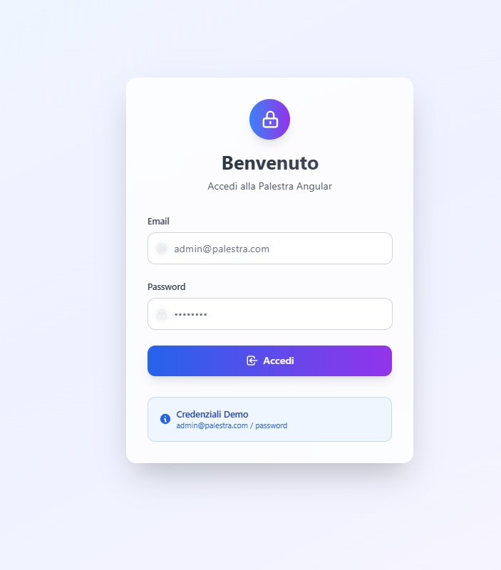
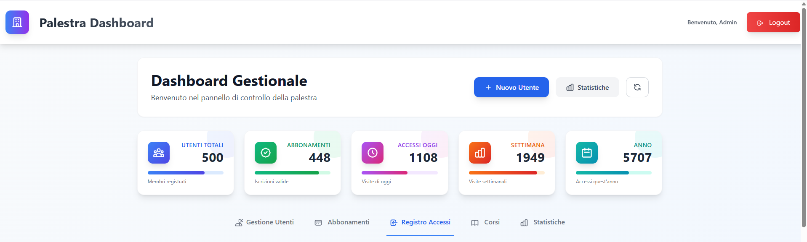
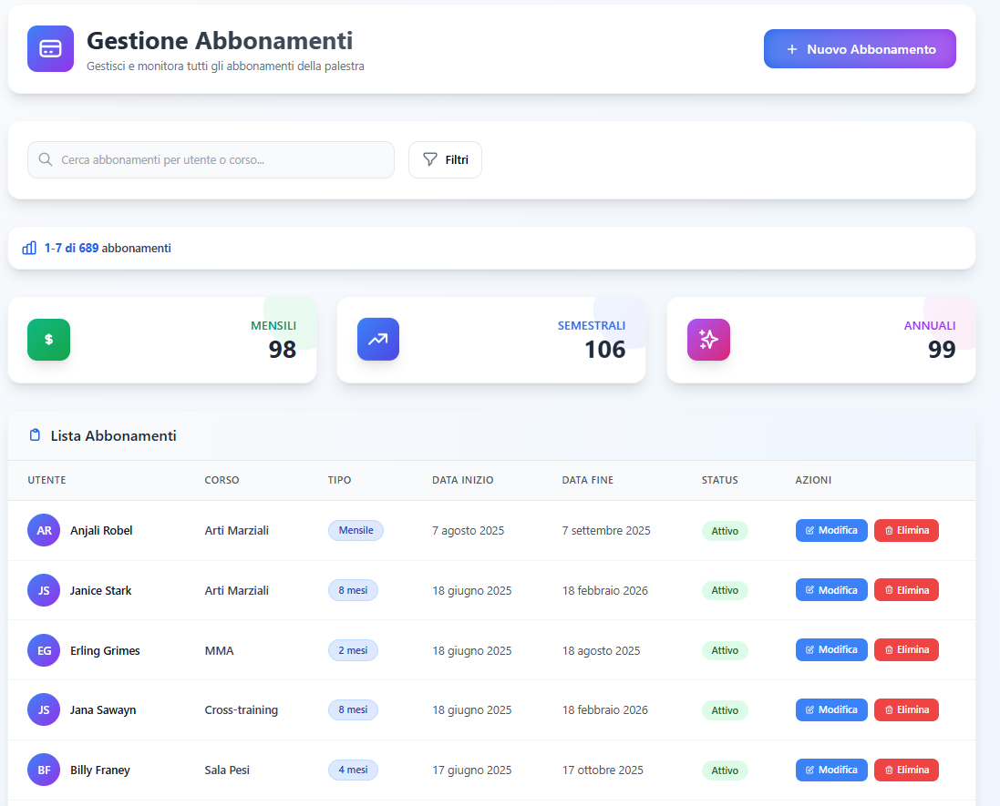
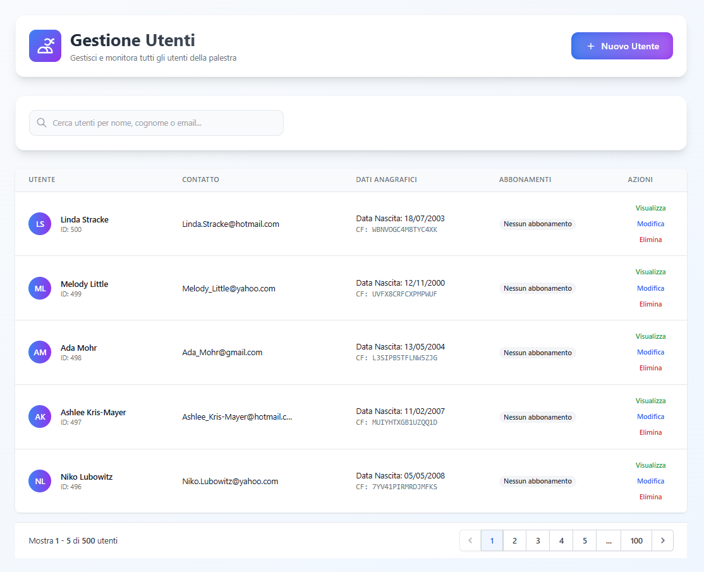
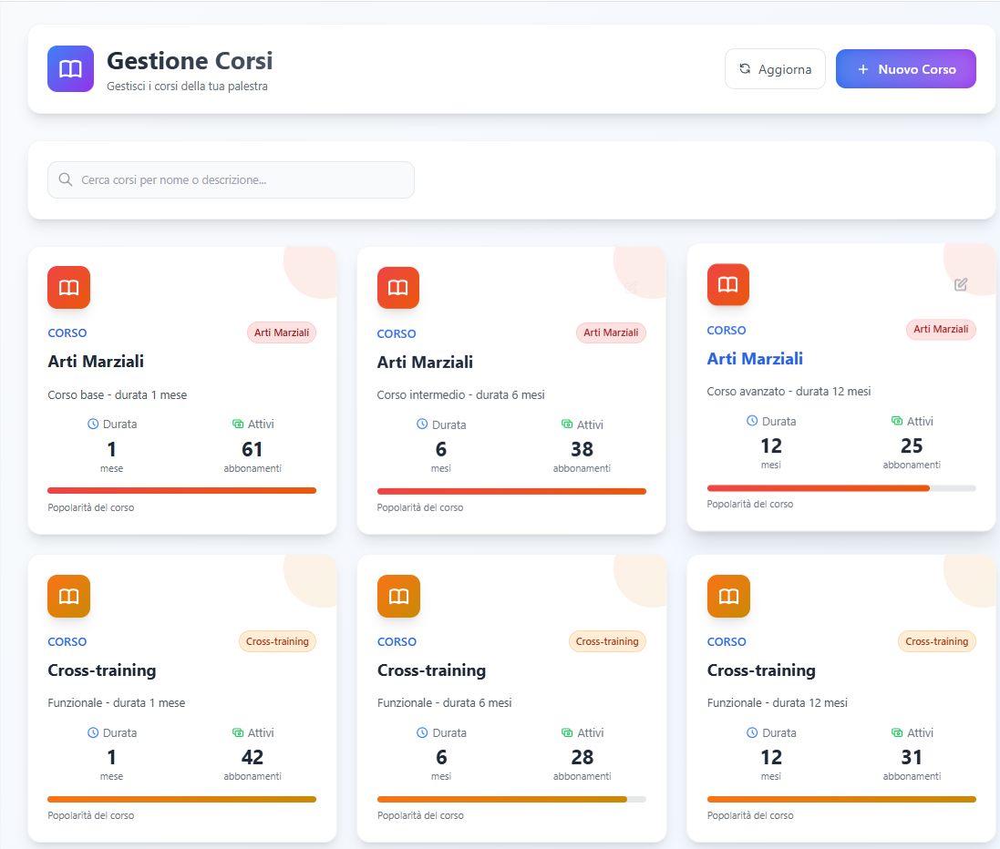
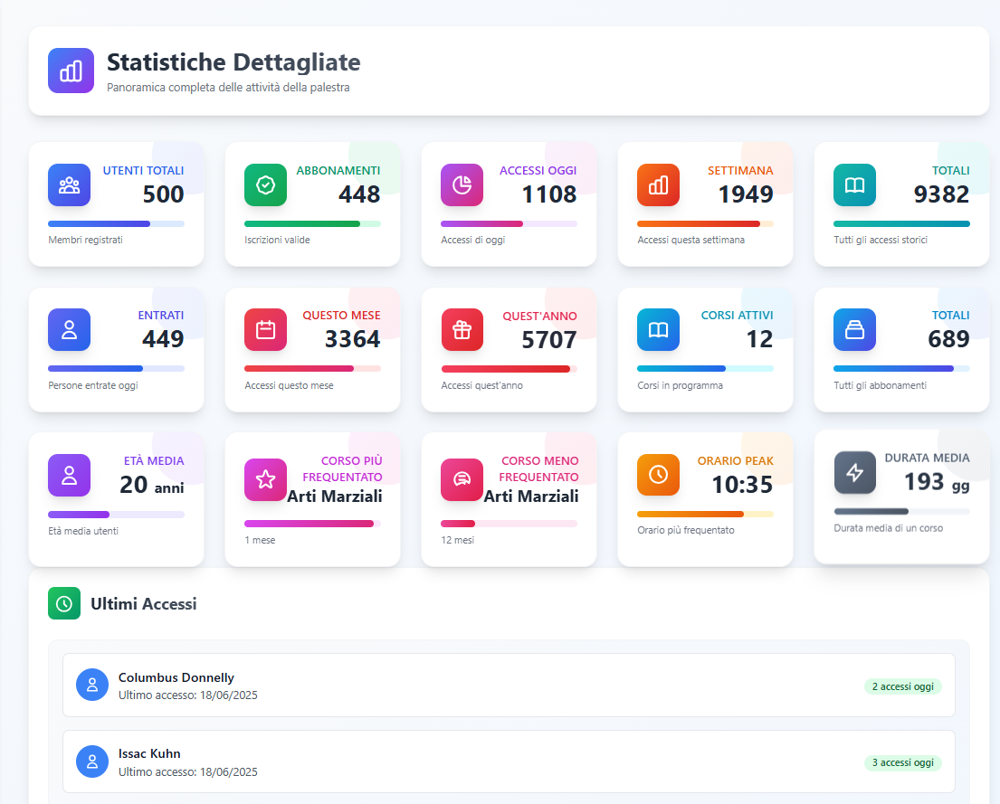
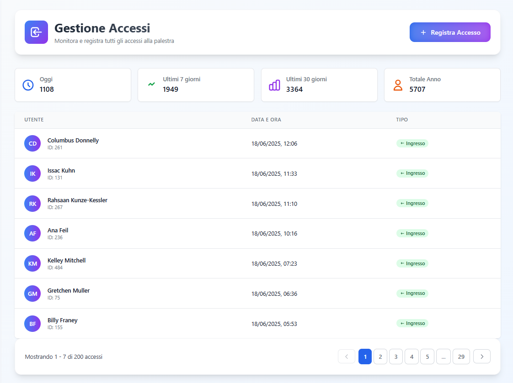

# 🏋️‍♀️ Palestra Angular

<div align="center">
  
  
  [](https://angular.io/)
  [](https://nodejs.org/)
  [](https://www.mysql.com/)
  [](https://www.typescriptlang.org/)
</div>

## 📋 Panoramica

**Palestra Angular** è una moderna applicazione web full-stack per la gestione completa di palestre e centri fitness. Sviluppata con Angular 20 e Node.js, offre un'interfaccia intuitiva e funzionalità avanzate per amministratori e gestori di palestre.

### ✨ Caratteristiche Principali

- 🔐 **Sistema di Autenticazione** - Login sicuro con JWT
- 👥 **Gestione Utenti** - Amministrazione completa degli iscritti
- 🎫 **Gestione Abbonamenti** - Creazione e monitoraggio delle sottoscrizioni
- 📊 **Analytics Avanzate** - Dashboard con statistiche dettagliate
- 🏃‍♂️ **Gestione Corsi** - Organizzazione dei corsi e delle attività
- 🚪 **Controllo Accessi** - Monitoraggio degli ingressi in palestra
- 📱 **Design Responsive** - Ottimizzato per desktop e mobile
- ⚡ **Performance Ottimizzate** - Caricamento veloce e UX fluida

## 📷 Screenshots

<details>
  <summary>Clicca per vedere gli screenshot dell'applicazione</summary>
  
  **Pagina di Login**
  <br/>
  

  **Dashboard Principale**
  

  **Gestione Abbonamenti**
  

  **Gestione Utenti**
  

  **Gestione Corsi**
  

  **Statistiche**
  

  **Gestione Accessi**
  

</details>

## 🛠️ Stack Tecnologico

### Frontend
- **Angular 20** - Framework principale
- **TypeScript** - Linguaggio di programmazione
- **RxJS** - Gestione reattiva degli stati
- **Angular Router** - Navigazione SPA
- **CSS3** - Styling moderno

### Backend
- **Node.js** - Runtime JavaScript
- **Express.js** - Framework web
- **MySQL** - Database relazionale
- **bcrypt** - Hashing password
- **Faker.js** - Generazione dati di test

## 🚀 Installazione e Setup

### Prerequisiti
- Node.js (versione 18 o superiore)
- npm o yarn
- MySQL Server
- Angular CLI

### 1. Clona il Repository
```bash
git clone https://github.com/marruzz/palestra-angular.git
cd palestra-angular
```

### 2. Setup Backend
```bash
cd backend
npm install

# Crea il tuo file di configurazione .env partendo dall'esempio
cp .env.example .env

# Apri il file .env e inserisci le tue credenziali per il database e le altre variabili

# Configura il database MySQL
# Importa il file config/palestra-angular.sql nel tuo database MySQL

# Avvia il server backend
npm start
# oppure per development
npm run dev
```

### 3. Setup Frontend
```bash
# Torna alla root del progetto
cd ..

# Installa le dipendenze
npm install

# Avvia il server di sviluppo
npm start
```

### 4. Accedi all'Applicazione
Apri il browser e naviga su `http://localhost:4200`

## 🗂️ Struttura del Progetto

```
palestra-angular/
├── 📁 src/
│   ├── 📁 app/
│   │   ├── 📁 Pages/
│   │   │   ├── 📁 Dashboard/        # Dashboard principale
│   │   │   │   ├── 📁 users-management/
│   │   │   │   ├── 📁 subscriptions-management/
│   │   │   │   ├── 📁 accesses-management/
│   │   │   │   ├── 📁 corsi-management/
│   │   │   │   └── 📁 stats-page/
│   │   │   └── 📁 login/           # Pagina di login
│   │   └── 📁 shared/
│   │       ├── 📁 services/        # Servizi Angular
│   │       ├── 📁 models/          # Interfacce TypeScript
│   │       ├── 📁 components/      # Componenti condivisi
│   │       └── 📁 interceptors/    # HTTP Interceptors
│   ├── 📁 backend/
│   │   ├── 📄 server.js               # Server Express
│   │   ├── 📁 controllers/            # Logic controllers
│   │   ├── 📁 routes/                 # API routes
│   │   ├── 📁 config/                 # Database configuration
│   │   └── 📄 .env.example           # File di esempio per le variabili d'ambiente
│   └── 📁 public/                     # Assets statici
```

## 🔧 Scripts Disponibili

### Frontend
```bash
npm start          # Avvia il server di sviluppo
npm run build      # Build per produzione
npm test           # Esegue i test
npm run watch      # Build in modalità watch
```

### Backend
```bash
cd backend
npm start          # Avvia il server di produzione
npm run dev        # Avvia con nodemon per development
```

## 📡 API Endpoints

La documentazione completa delle API è in fase di sviluppo. Ecco alcuni degli endpoint principali:

| Metodo | Endpoint                  | Descrizione                      |
|--------|---------------------------|----------------------------------|
| POST   | `/api/auth/login`         | Esegue il login di un utente.    |
| GET    | `/api/users`              | Restituisce la lista degli utenti.|
| POST   | `/api/users`              | Crea un nuovo utente.            |
| GET    | `/api/users/:id`          | Dettagli di un singolo utente.   |
| PUT    | `/api/users/:id`          | Aggiorna un utente esistente.    |
| DELETE | `/api/users/:id`          | Elimina un utente.               |

## 📊 Funzionalità Dashboard

### 🏠 Panoramica Generale
- Statistiche in tempo reale degli utenti attivi
- Grafici delle presenze giornaliere/settimanali
- Riepilogo abbonamenti attivi/scaduti
- Indicatori di performance della palestra

### 👤 Gestione Utenti
- ➕ Creazione nuovo utente
- ✏️ Modifica dati utente esistente
- 🗑️ Eliminazione utente
- 🔍 Ricerca e filtri avanzati
- 📋 Visualizzazione dettagliata profili

### 🎫 Gestione Abbonamenti
- 📝 Creazione nuovi abbonamenti
- 📅 Monitoraggio scadenze
- 💰 Gestione pagamenti
- 📊 Report abbonamenti

### 🚪 Controllo Accessi
- ⏰ Log degli ingressi/uscite
- 📈 Statistiche di frequentazione
- 🔔 Notifiche accessi non autorizzati

### 🏃‍♂️ Gestione Corsi
- 📋 Programmazione corsi
- 👨‍🏫 Assegnazione istruttori
- 👥 Gestione prenotazioni
- 📊 Analytics partecipazione

## 🔒 Sicurezza

- **Autenticazione JWT** - Token sicuri per l'accesso
- **Password Hashing** - bcrypt per la protezione delle password
- **Error Handling** - Gestione centralizzata degli errori
- **Input Validation** - Validazione lato client e server

## 🤝 Contribuire

1. Fai fork del progetto
2. Crea un branch per la tua feature (`git checkout -b feature/AmazingFeature`)
3. Committa le tue modifiche (`git commit -m 'Add some AmazingFeature'`)
4. Push al branch (`git push origin feature/AmazingFeature`)
5. Apri una Pull Request

## 📝 License

Questo progetto è distribuito sotto licenza MIT. Vedi il file `LICENSE` per maggiori dettagli.

## 📞 Supporto

Per supporto e domande:
- 🐛 Issues: [GitHub Issues](https://github.com/marruzz/palestra-angular/issues)

---

<div align="center">
  Realizzato con ❤️ usando Angular e Node.js
</div>
